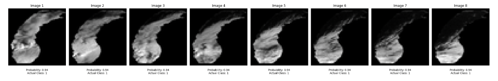
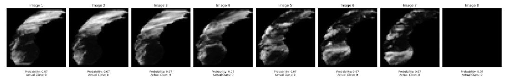

# LES-Precipitation-Forecasting-Multi-Modal-Architecture

This study is a term project for the course Neural Modelling (INFO 6106) I took in Fall'23 at Northeastern University, under the guidance of Prof. Dino Konstantopoulos. Our primary objective was to forecast precipitation over Lake Michigan using meteorological data, and satellite images and create a Multi-Modal model architecture to utilize both forms of information. We initially try to forecast using each data at a time and observe the results are not promising and have missing information if only one of the two is used, hence it is required to use both forms of information

  
  
Lake Michigan Satellite Image

# Overview

In this project, our objective was to create an amalgamation of CNN & RNN models to accurately forecast precipitation of snow/rain at Lake Michigan. We have ~16K satellite images of Lake Michigan with frequent cloud cover and subsequent weather forecast-specific variables with data at the hour level. We started by first creating a mapping between the images and the weather forecast data and then figured out how to structure our data to model forecasting. It's important to note that given its forecasting we will also not have images for the following days to predict the precipitation, hence we have to create sliding window-based data and then train our models on it.

When we created the mapping, we observed that there doesn't need to be a clear match with precipitation and cloud image, but it would be a sequence of images representing the flow of clouds over Lake Michigan which would indicate if it rains or not

This was a critical finding and with the Professor's hint about using ConvLSTM for the sequence of images, we were able to connect the dots. We then worked on creating classic Encoder-Decoder style architecture to use ConvLSTM for extracting features from a sequence of images, and LSTM for the time series Meteorological

Lastly, we treat this problem as a binary classification where if the precipitation sum in a day is >0.1 it means it rained else it did not.

# Modeling (ConvLSTM + LSTM)

As we discussed earlier we follow a classic Encoder-Decoder structure where we have ConvLSTM for image feature extraction along with LSTM for Meteorological time-series data, which we combine and feed to the decoder layer where an LSTM exists and generates output forecast

This model employs LSTM layers to process sequential meteorological data and ConvLSTM2D layers for spatial-temporal cloud imagery, integrating both data streams using an addition operation. This **addition** of encoder lstm and convlstm output is a new approach that we tried. The merged features are then decoded through additional LSTM layers regularized with dropout and finally passed through a dense layer to predict the precipitation.

We also added class weights to the data 80% for class 1 and 20% for class 0 to handle the impact of class imbalance, we chose 80% to counter-allocate the class imbalance of the labels

# Results
We're able to achieve an F1-score of 0.71, with a recall value of 0.85 which we believe represents good training for the model

  
  
The model predicts rain for the next day with a 94% probability and matches with the actual label of 1

  
  
As we see the clouds disappear, and our model forecasts no rain the next day which matches with the actual label as well

# Conclusion

We concluded our project with an optimistic note, we tried a lot of approaches, and eventually, the approach with a much deeper model worked. Initially starting with a lesser number of layers & of number of epochs didn't return a great accuracy for the same architecture, but as we saw it the loss drops after the 32nd epoch which was a great learning for us too. Overall in this project, we learned how we can work with sequential image data, and combine two different models to eventually create a Multi-Modal model. More detailed approach, code, and results are attached in the notebook - [LES Precipitation Forecasting.ipynb](/LES%20Precipitation%20Forecasting.ipynb)
